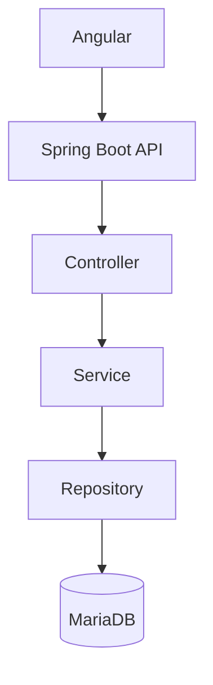
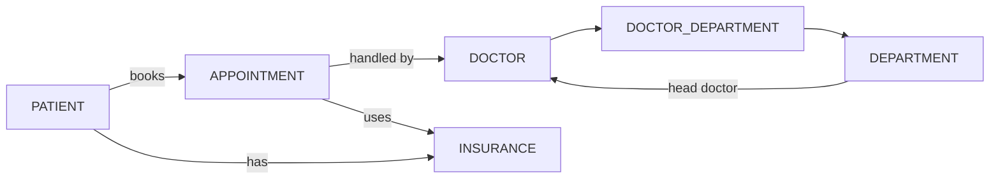

🏥 Hospital Management System

A secure, backend-focused Hospital Management System built using Spring Boot, Spring Security, JWT, OAuth2, Angular, and MariaDB, designed with a clean layered architecture and real-world hospital workflows.

🧩 Tech Stack

Backend: Spring Boot, Spring Security, JWT, OAuth2, JPA
Frontend: Angular
Database: MariaDB / MySQL
Cloud: AWS EC2

📐 Architecture

Layered architecture ensuring scalability, security, and maintainability.

🗄️ Database Design

Normalized relational design for hospital operations.

Core Tables:
PATIENT • APPOINTMENT • DOCTOR • DEPARTMENT • INSURANCE • DOCTOR_DEPARTMENT

🔄 System Flow

🔐 Security

• JWT-based stateless authentication

• OAuth2 login support

• Role-based access control (ADMIN, DOCTOR, PATIENT)
