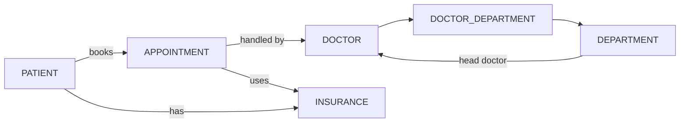

🏥 Hospital Management System

A secure, backend-focused Hospital Management System built using Spring Boot, Spring Security, JWT, OAuth2, Angular, and MariaDB, designed with a clean layered architecture and real-world hospital workflows.

🧩 Tech Stack

Backend: Spring Boot, Spring Security, JWT, OAuth2, JPA
Frontend: Angular
Database: MariaDB / MySQL
Cloud: AWS EC2

📐 Architecture

Layered architecture ensuring scalability, security, and maintainability.

flowchart TB

UI[Angular Frontend UI Layer]
API[Spring Boot REST API]

subgraph Backend["Spring Boot Backend"]
    C[Controller Layer @RestController]
    S[Service Layer Business Logic]
    R[Repository Layer Spring Data JPA]
    E[Entity Layer JPA Entities]
end

DB[(MariaDB / MySQL Database)]

UI -->|REST API| API
API --> C
C --> S
S --> R
R --> E
E --> DB

DB --> R
R --> S
S --> C
C --> API
API --> UI

🗄️ Database Design

Normalized relational design for hospital operations.

Core Tables:
PATIENT • APPOINTMENT • DOCTOR • DEPARTMENT • INSURANCE • DOCTOR_DEPARTMENT

🔄 System Flow

```mermaid
flowchart LR
PATIENT -->|books| APPOINTMENT
APPOINTMENT -->|handled by| DOCTOR
PATIENT -->|has| INSURANCE
APPOINTMENT -->|uses| INSURANCE
DOCTOR --> DOCTOR_DEPARTMENT --> DEPARTMENT
DEPARTMENT -->|head doctor| DOCTOR
```

🔐 Security

• JWT-based stateless authentication

• OAuth2 login support

• Role-based access control (ADMIN, DOCTOR, PATIENT)
